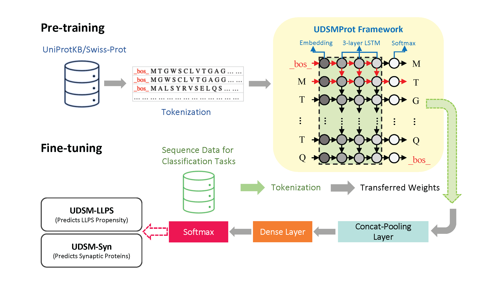

## UDSM-LLPS-Syn
In this study, we applied the deep sequence model – [UDSMProt](https://github.com/nstrodt/UDSMProt) to two new protein classification tasks.
1. **predict proteins with liquid-liquid phase separation propensity**
2. **predict synaptic proteins** 

Our results have shown that, without prior domain knowledge and only based on protein sequences, the fine-tuned language models achieved high classification accuracies and outperformed baseline models using compositional *k*-mer features in both tasks. For details of this work, please refer to our paper [**"Deep sequence representation learning for predicting human proteins with liquid-liquid phase separation propensity and synaptic functions"**](https://dl.acm.org/doi/10.1145/3535508.3545550) (Wei and Wang, 2022)

  </img>

## Dependencies
Please refer to the orignal repository of [UDSMProt](https://github.com/nstrodt/UDSMProt) for detailed information.

## Application Documentation
Users are welcome to use the fine-tuned models in both learning tasks for comparisons in their own research. 
Here, we provide one example to show the application of the fine-tuned UDSM-LLPS models in the first learning task. As stated in our paper, in addition to LLPSDB and PhaSepDB data, we also evaluated the performance of UDSM-LLPS on another well-known database – [DrLLPS](http://llps.biocuckoo.cn/). DrLLPS is currently the most comprehensive database with the largest collection of LLPS-associated proteins in 164 eukaryotes. In DrLLPS, LLPS-associated proteins can be browsed by three LLPS types, including
<ul>
  <li>scaffolds, proteins that can drive or undergo LLPS;</li>
  <li>clients, proteins that can be recruited by scaffolds for the formation of biomolecular condensates;</li>
  <li>regulators, proteins that have not been identified to undergo LLPS but shown to be involved in regulating LLPS behaviors.</li>
</ul>

### Description of files
<ul>
  <li>DrLLPS data: <code>task_1/application/<b>DrLLPS_data.csv</b></code> stores 3627 reviewed human LLPS-associated proteins categorized by the three types, consisting
of 100 scaffolds, 2,998 clients, and 529 regulators.</li>
  <li>Fine-tuned UDSM-LLPS models: <code><b>UDSM-LLPS_Random.pkl</b></code> and <code><b>UDSM-LLPS_UniRef.pkl</b></code> under <code>task_1/</code></li>
  <li>Utils file: <code><b>model_utils.py</b></code> downloaded from the original UDSMProt repository</li>
  <li>Token file: <code><b>tok_itos.npy</b></code>
</ul>

### Jupyter Notebook Documentation
Please see two Jupyter Notebooks under <code>task_1/application/</code> for detailed steps:
<ul>
<li><code><b>1. Predict LLPS propensity of DrLLPS data.ipynb</b></code></li>
<li><code><b>2. UDSM-LLPS prediction results on DrLLPS data.ipynb</b></code></li>
</ul>
